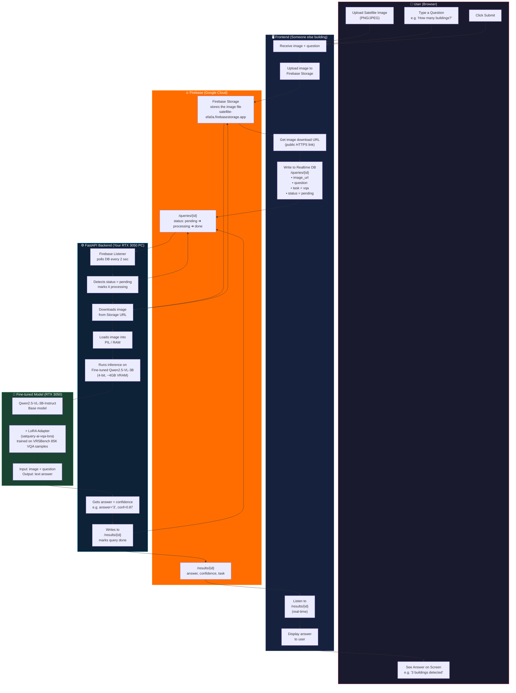

# SatQuery AI — Complete Architecture Flow

## System Overview



---

## Step-by-Step Flow (Plain English)

| Step | Who | What Happens |
|------|-----|-------------|
| 1 | **User** | Opens frontend, selects a satellite image and types a question |
| 2 | **Frontend** | Uploads the image to **Firebase Storage** (gets a download URL) |
| 3 | **Frontend** | Writes to **Realtime DB** `/queries/{id}` with `status: pending` |
| 4 | **Backend** | Firebase Listener detects the pending query (checks every 2 sec) |
| 5 | **Backend** | Updates `status: processing` so frontend knows it started |
| 6 | **Backend** | Downloads the image from Firebase Storage URL into RAM |
| 7 | **Model** | Qwen2.5-VL-3B + your LoRA adapter runs VQA inference on the image |
| 8 | **Model** | Returns answer text + confidence score |
| 9 | **Backend** | Writes answer to `/results/{id}`, sets `status: done` |
| 10 | **Frontend** | Was listening to `/results/{id}` — instantly receives the answer |
| 11 | **User** | Sees the answer on screen |

---

## Timing Breakdown

```
User clicks Submit
       │
       ▼
  ~2-5 sec    Image uploads to Firebase Storage
       │
       ▼
  ~0-2 sec    Backend listener detects pending query
       │
       ▼
  ~1-2 sec    Image downloads from Storage to backend
       │
       ▼
  ~5-15 sec   Qwen2.5-VL-3B runs inference (RTX 3050, 4-bit)
       │
       ▼
  ~0 sec      Answer written to Firebase, frontend notified instantly
       │
       ▼
Total: ~10-25 seconds end-to-end
```

---

## Component Responsibilities

```
┌─────────────────────────────────────────────────────────┐
│  FRONTEND DEV'S JOB                                     │
│  • File picker UI                                       │
│  • Upload to Firebase Storage                           │
│  • Write to /queries/{id} with status=pending           │
│  • Show loading spinner (status: processing)            │
│  • Listen to /results/{id} and display answer           │
└─────────────────────────────────────────────────────────┘

┌─────────────────────────────────────────────────────────┐
│  YOUR BACKEND (Already Built ✅)                        │
│  • FastAPI server on your RTX 3050 PC                   │
│  • firebase_listener.py polls DB every 2 sec            │
│  • Downloads image → runs Qwen2.5-VL-3B inference       │
│  • Writes answer back to Firebase                       │
│  • Also has REST API (/api/vqa, /api/caption, etc.)     │
└─────────────────────────────────────────────────────────┘

┌─────────────────────────────────────────────────────────┐
│  FIREBASE (Already Set Up ✅)                           │
│  • Storage: holds the uploaded images                   │
│  • Realtime DB: message queue between frontend/backend  │
│  • Acts as the "glue" — no direct connection needed     │
└─────────────────────────────────────────────────────────┘

┌─────────────────────────────────────────────────────────┐
│  YOUR FINE-TUNED MODEL (Training in progress)           │
│  • Base: Qwen2.5-VL-3B-Instruct                         │
│  • Adapter: LoRA r=8, trained on VRSBench 85K VQA       │
│  • Specialty: satellite/aerial imagery understanding    │
│  • Loaded once at backend startup, reused for all req.  │
└─────────────────────────────────────────────────────────┘
```
